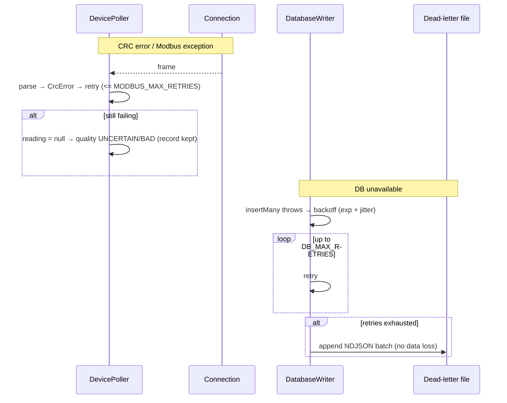
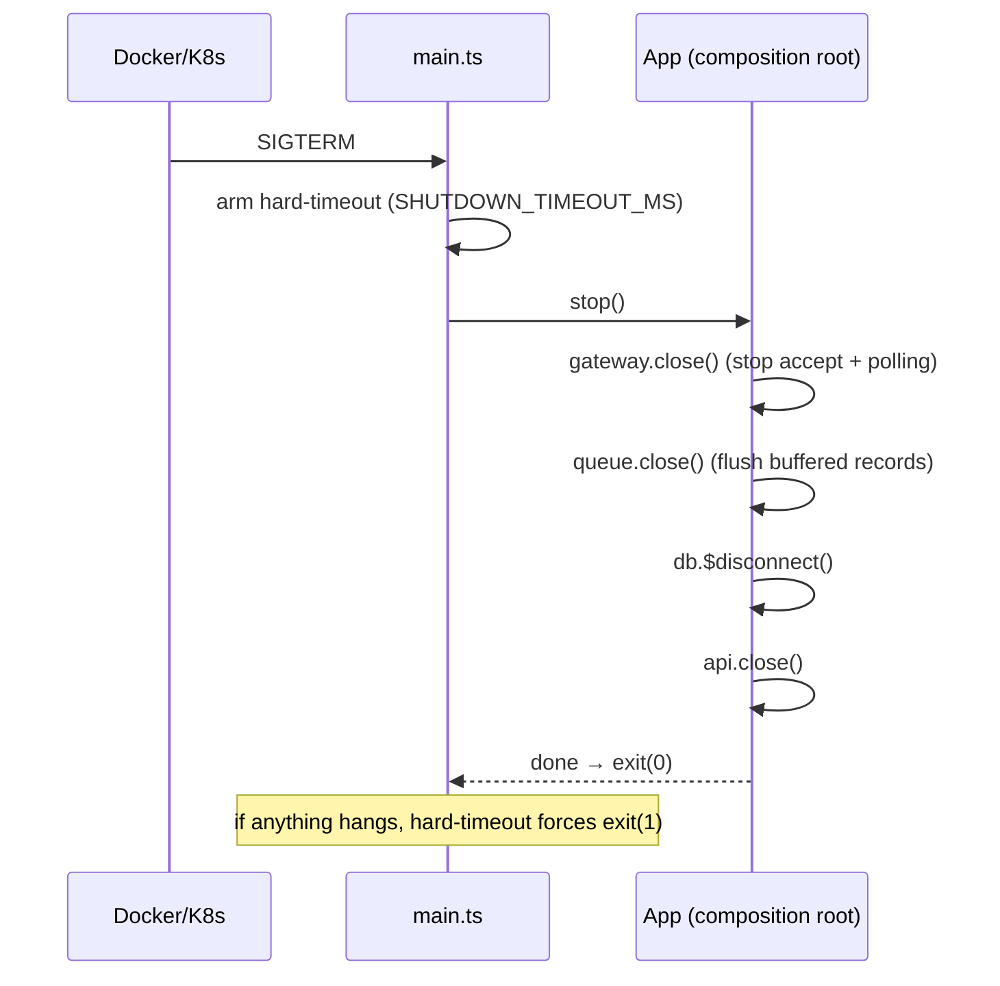

# Sequence Diagrams

## 1. Gateway connection + poll cycle

```mermaid
sequenceDiagram
    participant GW as X5050 (TCP client)
    participant SRV as GatewayServer
    participant CON as Connection
    participant POL as DevicePoller
    participant DEC as Modbus (codec/decoder)
    participant Q as BatchQueue
    participant W as DatabaseWriter
    participant DB as PostgreSQL

    GW->>SRV: TCP connect :4196
    SRV->>SRV: rate-limit + maxConnections check
    SRV->>CON: new Connection(socket)
    SRV->>POL: new DevicePoller(...); start()

    loop every POLL_INTERVAL_MS, per device, per register
        POL->>CON: transact(FC03 request, expectedLen, timeout)
        CON->>GW: write RTU request
        GW-->>CON: RTU response bytes (may be chunked)
        CON->>CON: FrameDecoder.takeFrame(expectedLen)
        CON-->>POL: complete frame
        POL->>DEC: parseReadResponse (CRC, exception checks)
        POL->>DEC: decodeRegisters (float32, byteOrder)
    end
    POL->>POL: mapReadingsToRecord + validate (quality)
    POL->>Q: enqueue(TelemetryRecord)

    alt buffer >= 500 OR 2s elapsed
        Q->>W: flush(batch)
        W->>DB: createMany(batch)
        DB-->>W: rows written
        W-->>Q: ok (metrics + info log: rows, batch_ms, rows_per_sec)
    end
```

## 2. Failure & durability paths



## 3. Graceful shutdown (SIGTERM)


